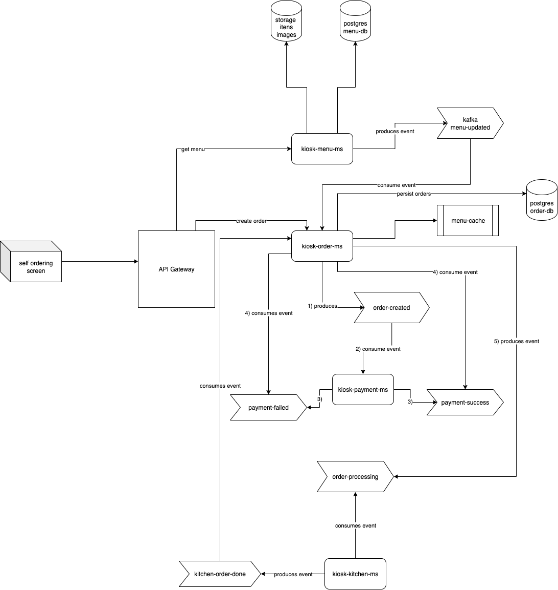

# Projeto Kiosk - Sistema de Autoatendimento Fast Food

Este projeto tem como objetivo principal a construção do backend de um sistema de autoatendimento para restaurantes fast-food, similar aos totens de pedidos com tela touch. Desenvolvido com uma arquitetura de microsserviços e comunicação assíncrona baseada em eventos, o `Kiosk` serve como um estudo prático e um item de portfólio para explorar conceitos avançados de sistemas distribuídos.

  
   
  <em>(Este é o diagrama de arquitetura do projeto Kiosk, mostrando a comunicação entre os microsserviços e seus componentes.)</em>

## 🌟 Destaques do Projeto

* **Arquitetura de Microsserviços:** Divisão clara de responsabilidades em serviços independentes.
* **Comunicação Orientada a Eventos:** Utilização do Apache Kafka para comunicação assíncrona e desacoplada entre os microsserviços.
* **Poliglotismo:** Combinação de diferentes linguagens e frameworks para diferentes domínios (Java/Spring Boot e TypeScript/NestJS), simulando um ambiente de produção real.
* **Persistência Dedicada:** Cada microsserviço com seu próprio banco de dados PostgreSQL, garantindo autonomia e escalabilidade.
* **Cache Distribuído:** Utilização do Redis para cache de dados críticos, otimizando o desempenho do sistema.
* **Observabilidade:** Implementação de logging estruturado, métricas e tracing distribuído para monitorar a saúde e o desempenho do sistema.
* **Containerização & Orquestração:** Utilização de Docker para empacotamento e Kubernetes para orquestração e deploy.
* **CI/CD:** Pipelines de Integração e Entrega Contínua (CI/CD) com GitHub Actions para automatizar builds, testes e deploys.

## 🚀 Microsserviços & Tecnologias

O sistema `Kiosk` é composto por 4 microsserviços principais, cada um com sua responsabilidade e stack tecnológica:

### 1. `kiosk-menu-ms` (Serviço de Cardápio)
* **Responsabilidade:** Gerenciar o cardápio do restaurante (itens, categorias, preços, imagens).
* **Tecnologias:** **NestJS** (TypeScript), PostgreSQL (para persistência de dados do cardápio).
* **Comunicação:** Publica eventos `menu-updated` no Kafka quando o cardápio sofre alterações.

### 2. `kiosk-order-ms` (Serviço de Pedidos)
* **Responsabilidade:** Criar, gerenciar e rastrear o ciclo de vida dos pedidos.
* **Tecnologias:** **Spring Boot** (Java), PostgreSQL (para persistência de dados de pedidos), **Redis** (para cache de itens do cardápio).
* **Comunicação:**
    * Recebe requisições do API Gateway para criar novos pedidos.
    * Publica eventos `order-created`, `order-processing`, `order-cancelled` no Kafka.
    * Consome eventos `payment-successful` e `payment-failed` do serviço de pagamento.
    * Consome eventos `order-ready` e `order-collected` do serviço de cozinha.
    * Consome eventos `menu-updated` do serviço de cardápio para manter seu cache Redis atualizado com informações de preço e disponibilidade dos itens.

### 3. `kiosk-payment-ms` (Serviço de Pagamentos)
* **Responsabilidade:** Processar pagamentos dos pedidos.
* **Tecnologias:** **Spring Boot** (Java), PostgreSQL (para persistência de dados de pagamentos).
* **Comunicação:**
    * Consome eventos `order-created` do serviço de pedidos.
    * Publica eventos `payment-successful` ou `payment-failed` no Kafka, indicando o resultado da transação.

### 4. `kiosk-kitchen-ms` (Serviço de Cozinha)
* **Responsabilidade:** Gerenciar o status dos pedidos na cozinha, indicando quando estão prontos para retirada.
* **Tecnologias:** **NestJS** (TypeScript), PostgreSQL (para persistência de status de pedidos na cozinha, ou pode espelhar dados do order-ms).
* **Comunicação:**
    * Consome eventos `order-created` e `order-processing` do serviço de pedidos.
    * Publica eventos `order-ready` e no Kafka, atualizando o status do pedido para o cliente.

## ⚙️ Componentes de Infraestrutura

Além dos microsserviços, a arquitetura conta com os seguintes componentes de infraestrutura:

* **Apache Kafka:** Plataforma de streaming de eventos distribuída, utilizada para a comunicação assíncrona entre todos os microsserviços.
* **PostgreSQL:** Banco de dados relacional robusto, utilizado por cada microsserviço para sua persistência dedicada.
* **Redis:** Banco de dados em memória, utilizado pelo `kiosk-order-ms` para cache de dados do cardápio, otimizando a consulta de preços e informações de itens.
* **API Gateway:** Ponto de entrada unificado para as requisições externas (como a tela de autoatendimento), responsável pelo roteamento e, futuramente, por aspectos de segurança e rate limiting. (Será implementado em uma fase posterior, inicialmente o frontend se comunicará diretamente com os microsserviços para simplificar o desenvolvimento inicial).
* **Docker:** Usado para containerizar cada microsserviço e seus componentes de infraestrutura.
* **Kubernetes:** Plataforma de orquestração de containers para deploy, escalabilidade e gerenciamento dos microsserviços em ambiente de produção (ou similar).
* **Observabilidade:**
    * **Prometheus & Grafana:** Para coleta e visualização de métricas de desempenho e saúde dos serviços.
    * **Jaeger/Zipkin (com OpenTelemetry):** Para tracing distribuído, permitindo rastrear requisições através de múltiplos microsserviços.
    * **Solução de Logs Centralizados:** A ser definida (ex: ELK Stack ou Grafana Loki) para coleta e análise de logs estruturados.

## 🗺️ Fluxo de Eventos (Exemplo: Pedido)

O fluxo principal de um pedido segue uma arquitetura de saga, orquestrada por eventos no Kafka:

1.  O **`self ordering screen`** (frontend) envia uma requisição de `create order` para o **API Gateway** (ou diretamente para o `kiosk-order-ms` no início).
2.  O **`kiosk-order-ms`** (utilizando seu cache Redis para informações do cardápio) cria o pedido no seu banco de dados e publica um evento `order-created` no Kafka.
3.  O **`kiosk-payment-ms`** consome o evento `order-created`, processa o pagamento e publica um evento `payment-successful` ou `payment-failed` no Kafka.
4.  O **`kiosk-order-ms`** consome o evento de pagamento, atualiza o status do pedido em seu banco de dados para "pago" ou "cancelado" e, em caso de sucesso, publica um evento `order-processing`.
5.  O **`kiosk-kitchen-ms`** consome o evento `order-processing`, inicia a preparação do pedido e, ao finalizar, publica um evento `order-ready`.
6.  O **`kiosk-order-ms`** consome o evento `order-ready`, atualiza o status final do pedido e notifica o `self ordering screen` (via API ou WebSockets).
7.  (Fluxo futuro) O **`kiosk-kitchen-ms`** publica `order-collected` quando o pedido é retirado pelo cliente.

## 🛣️ Roadmap & Próximos Passos

O desenvolvimento deste projeto será iterativo, abordando os conceitos gradualmente:

1.  **Fase 1: Core Functionality (Início)**
    * Implementação do `kiosk-menu-ms` (NestJS) com CRUD básico e publicação de `menu-updated` no Kafka.
    * Configuração inicial do ambiente Kafka, PostgreSQL(via Docker Compose).

2.  **Fase 2: Pedido e Pagamento**
    * Implementação do `kiosk-order-ms` (Spring Boot) para criação e gerenciamento de pedidos, consumindo `menu-updated` para popular o cache Redis, e publicando eventos.
    * Implementação do `kiosk-payment-ms` (Spring Boot) para processamento de pagamentos.
    * Testes do fluxo completo de pedido e pagamento via eventos.

3.  **Fase 3: Cozinha e Status**
    * Implementação do `kiosk-kitchen-ms` (NestJS) para gestão do status de preparo.
    * Refinamento do fluxo de eventos e estados do pedido.

4.  **Fase 4: Infraestrutura & Observabilidade**
    * Configuração de Prometheus/Grafana para métricas.
    * Implementação de OpenTelemetry para tracing distribuído.
    * Configuração de solução de logs centralizados.
    * Criação de manifestos Kubernetes e deploy dos microsserviços em um cluster local (Minikube/Kind) ou na nuvem.

5.  **Fase 5: API Gateway & Frontend Integration**
    * Implementação/configuração do API Gateway (ex: Kong, Spring Cloud Gateway).
    * Integração do `self ordering screen` (frontend) com o API Gateway.
    * Considerar WebSockets para atualizações em tempo real.

## 🛠️ Tecnologias Utilizadas

* **Backend:**
    * Java (Spring Boot)
    * TypeScript (NestJS)
* **Bancos de Dados:**
    * PostgreSQL
    * Redis (Cache)
* **Comunicação Assíncrona:**
    * Apache Kafka
* **Containerização:**
    * Docker
* **Orquestração:**
    * Kubernetes
* **Observabilidade:**
    * OpenTelemetry (Tracing)
    * Prometheus (Métricas)
    * Grafana (Dashboards)
* **CI/CD:**
    * GitHub Actions